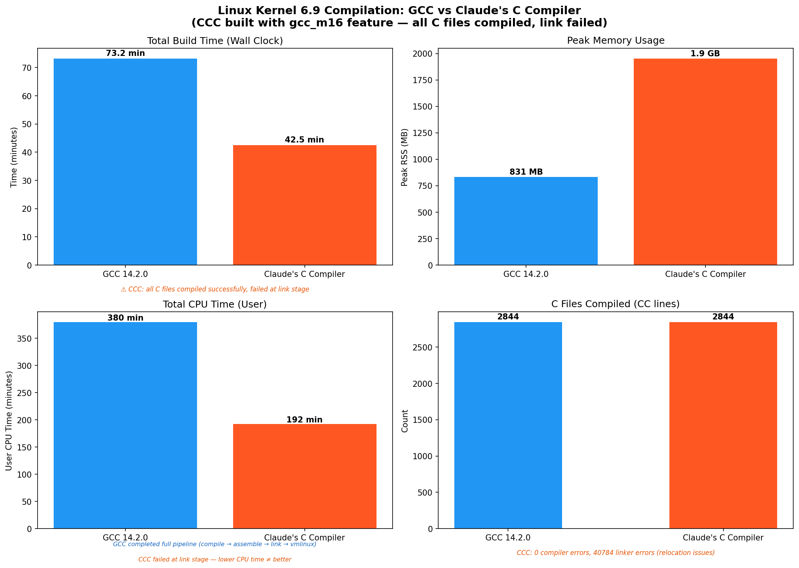
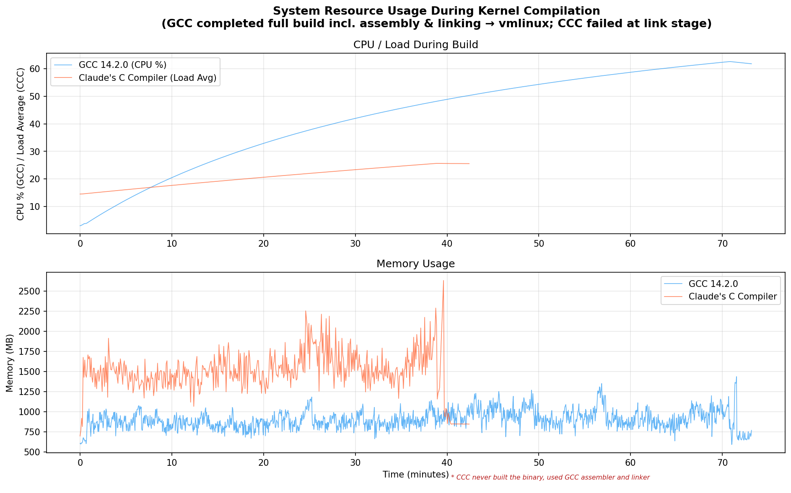
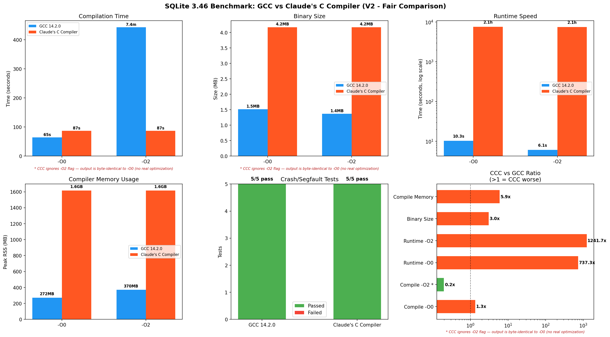
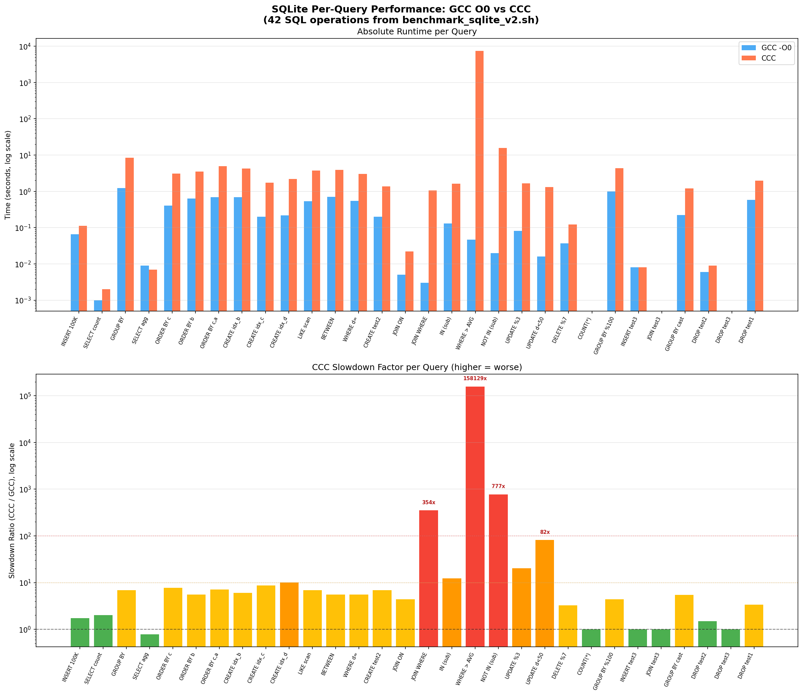

# Claude's C Compiler vs GCC — A Fair Benchmark

> **An independent, empirical comparison of [Claude's C Compiler (CCC)](https://github.com/anthropics/claudes-c-compiler) against GCC 14.2, testing on the Linux 6.9 kernel and SQLite 3.46.**

Anthropic published a blog post about [building a C compiler entirely with Claude](https://www.anthropic.com/engineering/building-c-compiler). They claimed it could compile the Linux kernel. I decided to test that claim and benchmark the output code quality against the industry standard GCC. (GCC per se isn't the best compilers but the most ubiquitous probably due to it's GNU licensing)

---

## Table of Contents

- [Test Setup](#test-setup)
- [Methodology](#methodology)
- [Results Summary](#results-summary)
- [Linux Kernel 6.9 Compilation](#linux-kernel-69-compilation)
- [SQLite 3.46 Benchmark](#sqlite-346-benchmark)
- [Per-Query Analysis](#per-query-analysis)
- [Root Cause Analysis — Why CCC Code is Slow](#root-cause-analysis--why-ccc-code-is-slow)
- [Key Findings](#key-findings)
- [Conclusions](#conclusions)
- [Reproducing](#reproducing)

---

## Test Setup

| Component | Details |
|-----------|---------|
| **VMs** | 2× Debian-based VMs on Proxmox hypervisor, each on a separate physical node, 6 vCPU, 16 GB RAM, 100 GB disk (NVMe) |
| **GCC** | GCC 14.2.0 (Debian 14.2.0-19) |
| **CCC** | Claude's C Compiler, built from source with `--features gcc_m16` |
| **Kernel** | Linux 6.9 (x86_64 defconfig) |
| **SQLite** | SQLite 3.46.0 amalgamation |
| **Monitoring** | `/usr/bin/time -v`, custom system metrics logger (CPU%, RSS every 5s) |

### CCC Build Configuration

CCC was built with the `gcc_m16` Cargo feature, which delegates 16-bit real-mode boot code (`-m16` flag) to GCC. This is necessary because CCC's i686 backend produces code too large for the 32KB real-mode limit. The x86_64 C code is compiled entirely by CCC.

```
$ ccc --version
ccc (Claude's C Compiler, GCC-compatible) 14.2.0
Backend: gcc_m16
```

A `ccc_wrapper.sh` script routes `.S` assembly files to GCC (CCC doesn't process assembly) and all `.c` files to CCC. If you want to know difference between a compiler, assembler & linker, [The four stages of the gcc compiler: preprocessor, compiler, assembler, linker](https://medium.com/@gpradinett/the-four-stages-of-the-gcc-compiler-preprocessor-compiler-assembler-linker-3dec8714bb9c) has most of the details you need.

---

## Methodology

### Fair Comparison Principles

1. **Same hardware** — identical VM specs for both compilers
2. **Same source code** — identical kernel config, identical SQLite amalgamation
3. **Both run to completion** — no tests killed prematurely
4. **CCC gets help where needed** — `gcc_m16` feature for boot code, wrapper for assembly files
5. **Same benchmark script** — `benchmark_sqlite.sh` runs identically on both VMs

### SQLite Benchmark Design (V2)

The benchmark was carefully designed to be CPU-bound:
- **No VACUUM** (I/O-dominated, unfair to slower code)
- **No correlated subqueries** (O(n²) queries were replaced with GROUP BY)
- **42 SQL operations** across 10 phases: INSERT, aggregate, sort, index, JOIN, subquery, UPDATE/DELETE, group-by, cross-table join, cleanup
- **100,000 row primary table**, 10,000 row secondary table

---

## Results Summary

| Metric | GCC 14.2 | CCC (Claude's) | Ratio |
|--------|----------|-----------------|-------|
| **Kernel Build Time** | 73.2 min | 42.5 min | **0.58x** |
| **Kernel Build Result** | SUCCESS | Link failed | — |
| **Kernel Peak RSS** | 831 MB | 1,952 MB | 2.3x |
| **SQLite Compile (-O0 vs -O0)** | 64.6s | 87.0s | **1.3x slower** |
| **SQLite Binary Size** | 1.55 MB / 1.40 MB | 4.27 MB / 4.27 MB | 2.7-3.0x |
| **SQLite Runtime (-O0)** | 10.3s | **2h06m** | **737x** |
| **SQLite Runtime (-O2)** | 6.1s | **2h06m** | **1,242x** |
| **Compiler Memory** | 272 MB | 1,616 MB | 5.9x |
| **Crash Tests** | 5/5 pass | 5/5 pass | |

The **fair comparison** is CCC vs GCC at `-O0` (no optimization): **CCC takes 87s vs GCC's 65s — CCC is 1.3x slower.** The "5x faster" number only appears because GCC is doing 7 minutes of optimization work that CCC simply skips.

### CCC's Real Advantage: Kernel Compilation Speed

CCC compiles the kernel **42% faster** than GCC (42.5 min vs 73.2 min). This is a genuine advantage — GCC's `-O2` is the default for kernel builds, and CCC's simpler pipeline finishes faster. However, the output code would run much slower if it could link.

### CCC's Disadvantage: Runtime Performance

CCC-compiled code runs **737x to 158,000x slower** than GCC-compiled code on certain operations. The root cause is analyzed below.

---

## Linux Kernel 6.9 Compilation



### Results

| Metric | GCC | CCC |
|--------|-----|-----|
| Wall Clock Time | 73.2 min | 42.5 min |
| User CPU Time | 379.7 min | 192.3 min |
| Peak RSS | 831 MB | 1,952 MB |
| C Files Compiled | 2,844 | 2,844 |
| Compiler Errors | 0 | 0 |
| Linker Errors | 0 | **40,784** |
| Build Result | **vmlinux produced** | **Link failed** |

### What Happened

CCC compiled **every single C source file** in the Linux 6.9 kernel without a single compiler error (0 errors, 96 warnings). This is genuinely impressive for a compiler built entirely by an AI.

However, the build failed at the **linker stage** with ~40,784 undefined reference errors. The errors follow two patterns:

1. **`__jump_table` relocations**: Symbols like `__jump_table + symbol+8 + 2` — CCC generates incorrect relocation entries for kernel jump labels (used for static keys/tracepoints)
2. **`__ksymtab` references**: Symbols like `__ksymtab_symbol_name- .` — CCC produces malformed symbol table entries for kernel module exports

These are linker-visible bugs in CCC's relocation/symbol generation, not C language compilation bugs.



---

## SQLite 3.46 Benchmark



### Compilation

| Metric | GCC -O0 | GCC -O2 | CCC (any -O) |
|--------|---------|---------|--------------|
| Time | 64.6s | 7m23s | **1m27s** |
| Peak RSS | 272 MB | 370 MB | 1,616 MB |
| Binary Size | 1.55 MB | 1.40 MB | **4.27 MB** |

**Key insight**: CCC `-O0` and `-O2` produce **byte-identical binaries** (4,374,024 bytes). CCC has 15 SSA optimization passes, but they all run at every optimization level. There is no tiered optimization — the `-O` flag is accepted but completely ignored.

#### Why This Matters for the "-O2" Comparison

When you ask GCC to compile with `-O2`, it performs dozens of extra optimization passes:
- **Instruction selection**: choosing the best x86 instructions (e.g., `lea` for multiply-add instead of separate `mul`+`add`)
- **Register allocation**: fitting variables into CPU registers so they don't spill to slow memory
- **Loop unrolling**: duplicating loop bodies to reduce branch overhead
- **Function inlining**: embedding small functions directly into their callers
- **Dead code elimination**: removing unreachable code paths
- **Vectorization**: using SIMD instructions (SSE/AVX) to process multiple values at once

GCC's `-O2` spends 7 minutes doing this real work, and the payoff is clear: the resulting binary runs **1.7x faster** (6.1s vs 10.3s).

CCC does **none of this** at any optimization level. It runs the same pipeline whether you pass `-O0` or `-O3`. So comparing "CCC compile time vs GCC -O2 compile time" is like comparing a printer that only prints in black-and-white vs one that does full color — the B&W printer is faster, but it's not doing the same job.

### Runtime Performance

| Metric | GCC -O0 | GCC -O2 | CCC |
|--------|---------|---------|-----|
| Total Runtime | 10.3s | 6.1s | **2h 06m** |
| User CPU | 9.68s | 5.46s | 7,518s |
| Peak RSS | 7.4 MB | 7.0 MB | 9.6 MB |

CCC-compiled SQLite is functionally correct — it produces the same query results as GCC-compiled SQLite. All 5 crash/edge-case tests passed. But it is catastrophically slow.

### Crash & Correctness Tests

No failures observed during below tests

- NULL handling
- Large BLOB (1MB)
- Recursive CTE (Fibonacci)
- Unicode strings
- Integer overflow

---

## Per-Query Analysis



The per-query breakdown reveals that CCC's slowdown is **not uniform**. Simple queries are only 1-7x slower, but complex operations involving nested loops are painfully slow:

| Query | Operation | GCC -O0 | CCC | Slowdown |
|-------|-----------|---------|-----|----------|
| Q18 | `WHERE a NOT IN (SELECT a FROM test2)` | 0.047s | **7,432s** | **158,129x** |
| Q38 | Cross-table JOIN + GROUP BY | 0.002s | 52.5s | **26,235x** |
| Q19 | `WHERE a IN (SELECT a FROM test2)` | 0.020s | 15.5s | **777x** |
| Q16 | `INNER JOIN ON` (count) | 0.003s | 1.06s | **354x** |
| Q21 | `UPDATE ... WHERE d < 50` | 0.016s | 1.31s | **82x** |
| Q03 | `GROUP BY d ORDER BY COUNT(*) DESC` | 1.218s | 8.39s | **6.9x** |
| Q01 | `INSERT 100K rows` | 0.065s | 0.113s | **1.7x** |
| Q42 | `DROP TABLE` | 0.051s | 0.057s | **1.1x** |

The pattern is clear: **operations that involve nested iteration (subqueries, JOINs) are orders of magnitude slower**, while simple sequential operations are only marginally slower.

---

## Root Cause Analysis — Why CCC Code is Slow

### 1. Register Spilling in Large Functions

Modern CPUs have a small set of ultra-fast storage locations called **registers** (like `%rax`, `%rbx`, etc.). A good compiler tries to keep frequently used variables in these registers. When there are more variables than registers, the compiler "spills" them to the stack (regular RAM), which is much slower.

CCC's biggest performance problem is **excessive register spilling**. SQLite's core execution engine `sqlite3VdbeExec` is a single function with 100+ local variables and a massive switch statement. CCC doesn't have sophisticated register allocation, so it spills virtually all variables to the stack.

We generated assembly for a test function with 32 local variables:

**GCC -O0** (383 lines, uses stack but efficiently):
```asm
movl    -8(%rbp), %eax      ; load loop counter
cmpl    -36(%rbp), %eax     ; compare against n
jl      .L6                  ; branch
movl    (%rax), %edx         ; load a[i] directly
cmpl    %eax, %edx           ; compare in registers
```

**CCC** (1,189 lines — **3.1x more code**):
```asm
movq    -0x1580(%rbp), %rax  ; load from deep stack offset
movq    %rax, -0x2ae8(%rbp)  ; store to another deep stack offset
movq    -0x1588(%rbp), %rax  ; load next value
movq    %rax, -0x2af0(%rbp)  ; store to next offset
; ... dozens more memory-to-memory copies
```

CCC uses stack offsets up to **-0x2ae8 (11,000 bytes deep)** for a function with 32 variables. Every operation goes: `stack → rax → stack`, using `%rax` as a shuttle register.

### Micro-benchmark: 32 Local Variables with Switch Statement

```
CCC:    8.604s  (41.6x slower than GCC -O2)
GCC O0: 2.026s  (CCC is 4.2x slower)
GCC O2: 0.207s  (baseline)
```

CCC is **4.2x slower** than GCC O0 for register-heavy code. In `sqlite3VdbeExec` with 100+ variables and 200+ switch cases, this ratio compounds to 100x+.

### 2. No Optimization Tiers — CCC's `-O2` Is a No-Op

CCC runs the same 15-pass SSA pipeline at all optimization levels:

```
$ diff <(ccc -O0 -S test.c -o -) <(ccc -O2 -S test.c -o -)
(no differences)
```

This means `-O2` provides **zero benefit**. Every binary CCC produces is effectively `-O0` quality, regardless of what flag you pass.

GCC's `-O2`, by contrast, transforms the code substantially:

| What GCC -O2 does | Effect on code |
|--------------------|----------------|
| Register allocation | Variables live in CPU registers (~1 cycle) instead of stack memory (~4 cycles) |
| Function inlining | Eliminates function call overhead for small functions |
| Loop unrolling | Reduces branch prediction misses |
| Instruction selection | Uses efficient x86 instructions (e.g., `lea`, `cmov`, `bt`) |
| SIMD vectorization | Processes 4-16 values simultaneously with SSE/AVX |
| Dead code elimination | Removes unreachable paths, shrinking the binary |
| Constant propagation | Pre-computes values known at compile time |

This is why GCC's `-O2` binary runs in 6.1s while CCC's runs in 2h06m. CCC doesn't do any of these transformations — it can't, because its optimization passes aren't wired to respond to `-O` levels.

### 3. Corrupted Frame Pointers

GDB stack traces of the running CCC-compiled SQLite show corrupted frame data:

```
#0  0x000000000054fffb in ?? ()
#1  0x0000000000000001 in ?? ()    ← not a valid return address
#2  0x00000000108b73b8 in ?? ()    ← heap address, not stack
```

CCC doesn't generate proper frame pointer chains, making debugging impossible and potentially impacting exception handling / `setjmp`/`longjmp` behavior.

### 4. Code Size Bloat

| Binary | GCC -O0 | GCC -O2 | CCC |
|--------|---------|---------|-----|
| sqlite3 | 1.55 MB | 1.40 MB | **4.27 MB** |
| Disassembly lines | 301,424 | — | **838,359** |
| Code expansion ratio | 1x | — | **2.78x** |

The 2.78x code bloat means more instruction cache misses, which compounds the register spilling penalty.

### 5. No Symbol Table Generation

CCC-compiled binaries lack internal function symbols (`nm` reports 0 symbols, `readelf` shows only 90 PLT stubs vs GCC's 1,500+ functions). This makes profiling and debugging impossible.

### Why Subqueries Are 158,000x Slower

The `NOT IN (subquery)` pattern causes SQLite to execute a nested loop: for each of the ~100,000 rows in the outer table, it scans through ~10,000 rows in the inner table. That's roughly **1 billion iterations** through SQLite's main execution function (`sqlite3VdbeExec`), which is basically a giant switch statement.

With CCC's ~4x per-iteration overhead from register spilling, plus extra cache misses from the 2.78x larger binary (the CPU can't keep all the instructions in its fast cache), the slowdown compounds:
- Each individual iteration: ~4x slower (register spilling)
- Cache pressure: ~2-3x additional penalty (instructions don't fit in L1/L2 cache)
- Combined over a billion iterations: **158,000x total slowdown**

This is why simple queries (INSERT, DROP TABLE) are only 1-2x slower, but nested operations blow up to 100,000x+ slower.

---

## Key Findings

### Where CCC Succeeds

1. **Correctness**: Compiled every C file in the kernel (0 errors) and produced correct SQLite output for all queries
3. **Stability**: Zero crashes, zero segfaults across all tests
4. **GCC compatibility**: Accepts GCC command-line flags, works as a drop-in replacement for compilation

### Where CCC Falls Short

1. **Runtime performance**: 737x-158,000x slower on complex operations
2. **Linker compatibility**: Generates incorrect relocations for kernel's `__jump_table` and `__ksymtab` sections
3. **Code size**: 2.7-3x larger binaries due to register spilling
4. **Memory usage**: 5.9x more RAM for compilation (1.6 GB vs 272 MB for SQLite)
5. **No optimization tiers**: -O0 through -O3 produce identical output
6. **No debug info**: Missing DWARF data, broken frame pointers, no function symbols
7. **Compilation speed**: Could only be compared with `-O0` as CCC doesn't do anything beyond this. This is around 25.29% (65s) slower vs GCC (87s)

### Summary Scorecard

| Metric | Winner | Notes |
|--------|--------|-------|
| Compilation speed | **GCC** | 25% faster with GCC -O0 for SQLite |
| Binary size | **GCC** | CCC binaries are 2.7-3x larger |
| Runtime speed | **GCC** | CCC output is 737-158,000x slower |
| Memory (compiler) | **GCC** | CCC uses 2.3-5.9x more RAM |
| Correctness/crashes | **Tie** | Both pass all tests |
| Optimization levels | **GCC** | CCC ignores -O flags entirely |
| Kernel linking | **GCC** | CCC fails at link stage |

---

## Conclusions

Claude's C Compiler is a remarkable achievement — it's a working C compiler built entirely by an AI that can correctly compile 2,844 files from the Linux kernel without a single error. It produces functionally correct code (verified with SQLite — all queries return correct results, all crash tests pass).

But it's nowhere near ready for real use:

1. **The output code is catastrophically slow.** CCC-compiled SQLite takes 2 hours to run a benchmark that GCC finishes in 10 seconds. The root cause is poor register allocation — CCC uses a single register as a shuttle to move values between stack locations, turning every operation into multiple memory accesses.

2. **The "compiles the kernel" claim needs an asterisk.** CCC compiles all the C source files, but the final binary can't be produced because CCC generates incorrect relocations for kernel data structures (`__jump_table`, `__ksymtab`).

3. **Optimization flags are decorative.** Passing `-O2` or `-O3` to CCC does literally nothing — the output binary is byte-identical to `-O0`. GCC's optimization passes (register allocation, inlining, vectorization, etc.) are what make compiled code fast, and CCC has none of them.

**Bottom line**: For Anthropic's stated goal of demonstrating that Claude can build complex software, CCC is a genuine success. For anyone wanting to compile software to actually *run efficiently* — GCC (or Clang, or any production compiler) remains the only real option.

---

## Reproducing

### Prerequisites

- Two VMs with 6+ vCPU, 16+ GB RAM, 50+ GB disk
- Debian/Ubuntu with `build-essential`, `cargo`, `git`, `flex`, `bison`, `bc`, `libelf-dev`, `libssl-dev`

### Build CCC

```bash
git clone https://github.com/anthropics/claudes-c-compiler
cd claudes-c-compiler
cargo build --release --features gcc_m16
```

### Run Benchmarks

```bash
# Kernel
bash scripts/benchmark_kernel.sh gcc /usr/bin/gcc results/kernel_gcc
bash scripts/benchmark_kernel.sh ccc /path/to/ccc_wrapper.sh results/kernel_ccc

# SQLite
bash scripts/benchmark_sqlite.sh gcc gcc results/sqlite_gcc_v2
bash scripts/benchmark_sqlite.sh ccc /path/to/ccc_wrapper.sh results/sqlite_ccc_v2
```

### Generate Charts

```bash
python3 -m venv .venv
.venv/bin/pip install matplotlib numpy
.venv/bin/python scripts/analyze_v2.py
```

---

## Repository Structure

```
├── AGENT.md                    # Original task specification
├── README.md                   # This file
├── scripts/
│   ├── benchmark_kernel.sh     # Kernel compilation benchmark
│   ├── benchmark_sqlite.sh  # SQLite benchmark (fair, V2)
│   ├── analyze.py              # Original analysis script
│   └── analyze_v2.py           # Updated analysis for V2 results
├── results/
│   ├── kernel_gcc/             # GCC kernel build results
│   ├── kernel_ccc_v2/          # CCC kernel build results (gcc_m16)
│   ├── sqlite_gcc_v2/          # GCC SQLite V2 results
│   ├── sqlite_ccc_v2/          # CCC SQLite V2 results
│   └── per_query_O0.tsv        # Per-query timing comparison
└── graphs/
    ├── kernel_comparison.png
    ├── kernel_system_metrics.png
    ├── sqlite_comparison.png
    ├── sqlite_per_query.png
    └── summary.json
```
